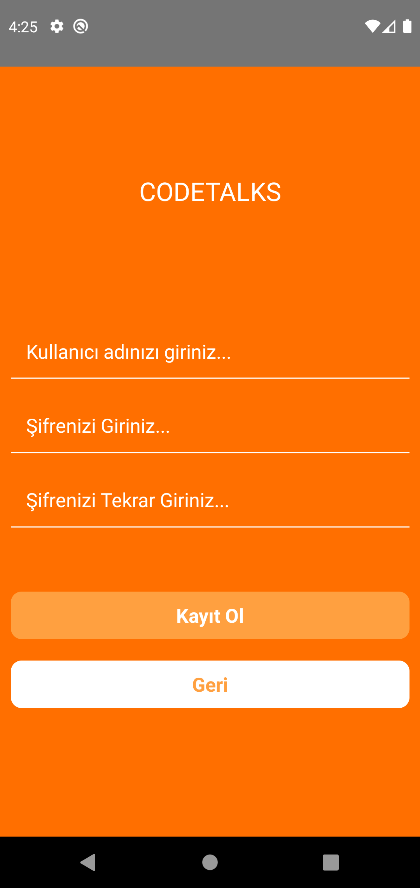
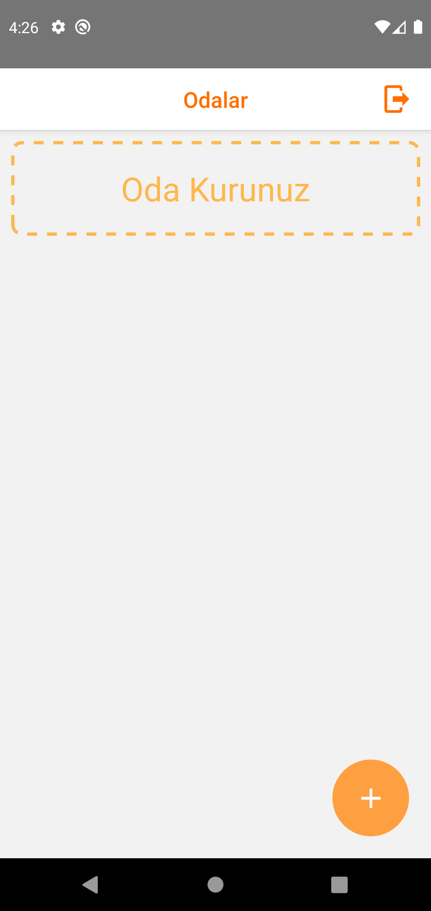
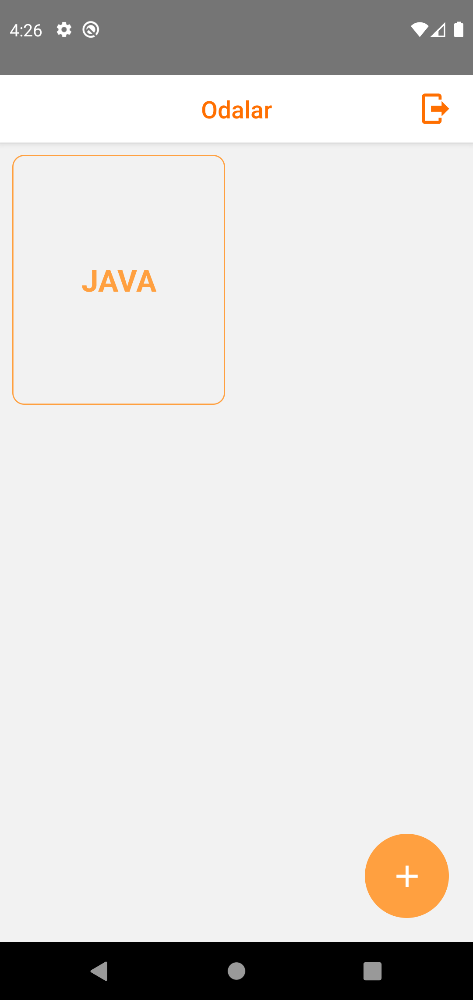
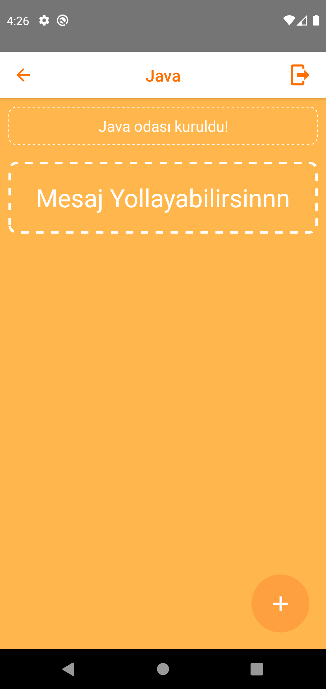
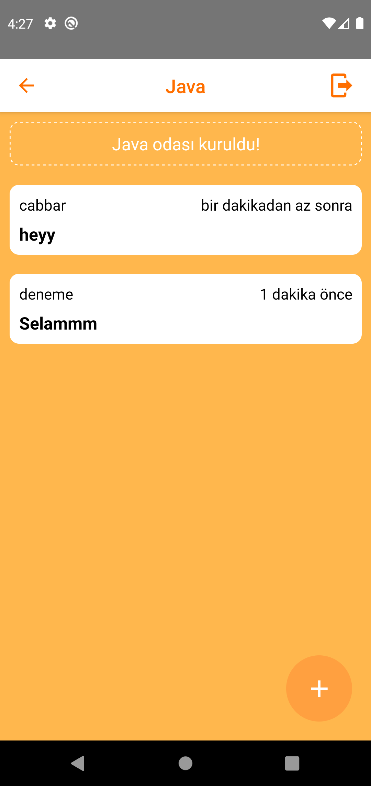
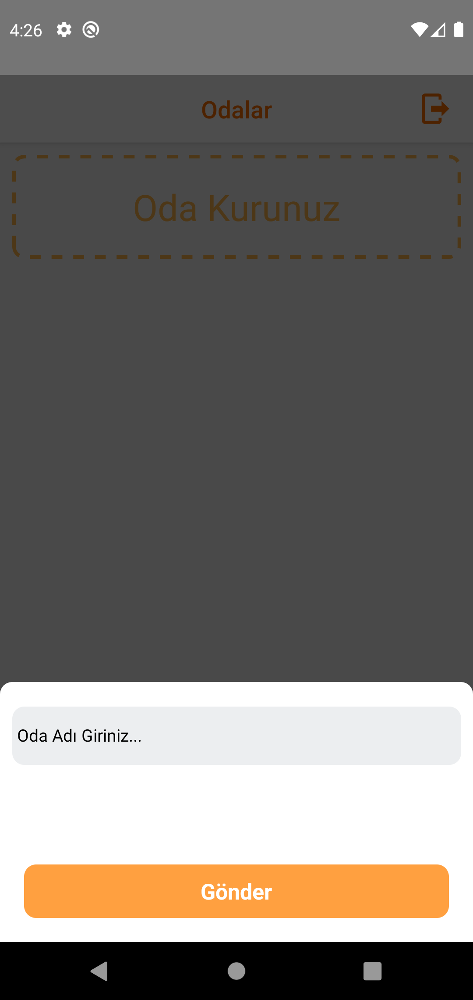

# Code Talks

## Tools

- Firebase
- React Navigation
- Formik
- React Native Flash Message
- React Native Modal
- React Native Vector Icons

## Özellikler

- Kayıt formu ile sisteme üye olabilmek.
- Kayıt olunan bilgiler ile sisteme giriş yapabilmek.
- Sohbet odasını oluşturabilmek.
- Oluşturulan odalarda sohbet edebilmek.

## Daha Fazla Bilgi İçin

Daha fazlasını şuradan öğrenebilirsiniz: [React documentation](https://reactnative.dev)
